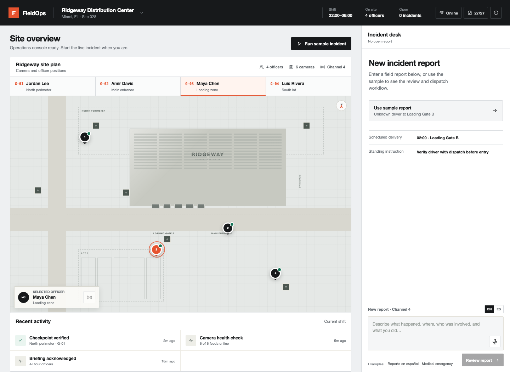

# FieldOps Copilot

An interactive command-center prototype for turning a field transmission into
a structured, evidence-backed incident and coordinating the response.

**Live demo:** [fieldops-copilot-nico.pages.dev](https://fieldops-copilot-nico.pages.dev)



This is an independent product exercise built from public information. It is
not an official Calvis product and is not affiliated with or endorsed by
Calvis. All people, incidents, locations, and operational data are synthetic.

## Try it in two minutes

1. Select **Unauthorized vehicle** and run the copilot.
2. Inspect the structured fields and their source evidence.
3. Open Camera 04, verify the incident, and dispatch the nearest officer.
4. Watch the projected route avoid the warehouse while the officer moves.
5. Reset, then enter `Need all officers in the north perimeter.`
6. Try `Officer Chen needs immediate support.` to see Chen excluded from the
   response roster.

Typed input works everywhere. Voice capture is an optional browser capability.

## What the prototype demonstrates

- English and Spanish incident extraction from typed or spoken reports
- Strict evidence traceability back to the original transmission
- Deterministic severity and response policy outside the model
- Automatic staffing for medium-, high-, and critical-severity incidents
- Full-roster requests and requester exclusion
- Nearest-officer selection based on each walkable route—not roster order
- Route-derived ETAs and animation timing
- Obstacle-aware paths that share the same geometry as the moving markers
- Six location-specific simulated camera views
- Offline queuing and synchronization
- Live OpenAI extraction with a deterministic fallback
- An in-product evaluation suite for extraction and policy behavior

## Product and safety boundaries

The model extracts only explicitly stated facts. It cannot set severity, select
officers, or decide operational policy. Evidence quotes must be exact
substrings of the transmission before normalized values are accepted.

```text
Typed or spoken report
        │
        ▼
Structured fact extraction ── unavailable ──▶ deterministic fallback
        │
        ▼
Evidence validation
        │
        ▼
Deterministic severity + staffing policy
        │
        ▼
Walkable-route ranking + response animation
```

The public demo has no incident database. A queued offline report is stored
only in the reviewer's browser and removed after synchronization or reset.
OpenAI requests use `store: false`.

## Architecture

- Next.js-compatible App Router on vinext
- React 19 and strict TypeScript
- Cloudflare Workers runtime and Cloudflare Pages public hostname
- OpenAI Responses API with strict Structured Outputs
- Feature-colocated domain, data, server, component, and test modules
- Local deterministic engine for resilience and public evaluation cases

```text
app/
  api/analyze/route.ts              # guarded server endpoint
  layout.tsx
  page.tsx
src/features/field-ops/
  components/                       # interactive operations console
  data/                             # synthetic site configuration
  domain/                           # extraction, policy, and routing rules
  server/                           # OpenAI boundary
cloudflare-pages/                   # public-hostname reverse proxy
```

The visual system and interface rationale are documented in
[`DESIGN.md`](./DESIGN.md). Security and data-handling notes live in
[`SECURITY.md`](./SECURITY.md).

## Local development

Requirements: Node.js 22 or newer and npm.

```bash
npm install
cp .env.example .env.local
npm run dev
```

`OPENAI_API_KEY` is optional locally. Without it, the deterministic engine keeps
the full interaction usable.

Run the complete validation suite:

```bash
npm run validate
```

Or run checks separately:

```bash
npm run lint
npm run typecheck
npm test
npm run build
npx knip
```

## Cloudflare deployment

Store the API key as an encrypted Worker secret, then deploy the application:

```bash
npx wrangler secret put OPENAI_API_KEY
npm run deploy
```

The Pages hostname forwards to the Worker through `cloudflare-pages/_worker.js`.
Configure its `UPSTREAM_ORIGIN` as a Pages secret and deploy that directory:

```bash
npx wrangler pages secret put UPSTREAM_ORIGIN \
  --project-name fieldops-copilot-nico
npx wrangler pages deploy cloudflare-pages \
  --project-name fieldops-copilot-nico \
  --branch main
```

No secret is prefixed with `NEXT_PUBLIC_`, embedded in a browser bundle, or
committed to the repository.
